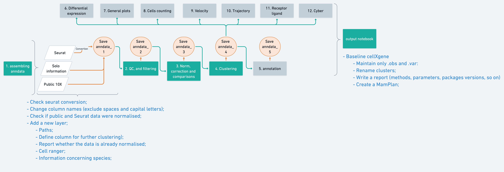

# loosolab_SC_RNA_framework

Here we are developing a set of notebooks for automation of scRNA-Seq of looso's lab.

# Workflow
The main workflow below is also presented in the powerpoint file.

# Notebooks
The directory "nooteboks" has the Jupyter notebooks under development.

Example files to run the notebooks are available here $/mnt/agnerds/loosolab_SC_RNA_framework/raw_data

# Modules instruction
The modules present in the notebook folder must be in the same notebook in your VM.
