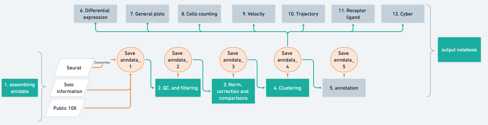

# loosolab_SC_RNA_framework

A python framework for single cell analysis. It provides a plethora of functions for conducting common analysis tasks and respective visualization. It also includes a number of jupyter notebooks to further streamline the analysis process, making it easy to follow and reproduce analysis results.

# Workflow



# Installation

1. Download the repository. This will download the repository to your current folder.
```
git clone https://gitlab.gwdg.de/loosolab/software/loosolab_sc_rna_framework.git
```
2. Change working directory to repository.
```
cd loosolab_sc_rna_framework
```
3. Install analysis environment. Note: using `mamba` is faster than `conda`, but this requires mamba to be installed.
```
mamba env create -f sctoolbox_env.yml
```
4. Activate the environment.
```
conda activate sctoolbox
```
5. If "jupyter-notebook" command is not available at this point: install notebook package.
```
pip install notebook
```
6. Register the environment as a jupyter kernel.
```
python -m ipykernel install --user --name sctoolbox --display-name "sctoolbox"
```
7. (optional) If you want to push changes to notebooks, you need to add the custom .gitconfig to enable clearing of notebook outputs:
```
git config --local include.path .gitconfig
```

# How to access the notebooks
1. Go to your local notebook folder - most likely in /home/\<user\>/notebooks:
```
cd ~/notebooks/
```

2. Create a symbolic link to the location where you cloned the framework
```
ln -s <path to loosolab_sc_rna_framework>
```

3. Get the notebook server URL by running:
```
jupyter notebook list
```

4. Copy the output URL from the previous command into your browser. 

5. You can now navigate to the `loosolab_sc_rna_framework/notebooks` folder containing the notebooks!


# Usage
1. Open the first notebook (`1_assembling_anndata.ipynb`) and set the `sctoolbox` kernel. You can use the included test dataset (or follow the instructions to set input data).

2. Carry on with the notebooks in increasing order 2, 3, 4. etc. to analyze your data!


Additional example files to run the notebooks are available here:
```
/mnt/agnerds/loosolab_SC_RNA_framework/examples/assembling_10_velocity
```


# Notebook overview
The main parts of the analysis workflow are provided as jupyter notebooks. They can be found in the `notebooks` directory.

## Notebook 1 (1_assembling_anndata.ipynb)

Assembly the 10X anndata to run velocity analysis, convert from Seurat to anndata object, assembly the 10X anndata object from public dataset.

## Notebook 2 (2_QC_filtering.ipynb)

QC and filtering steps.
