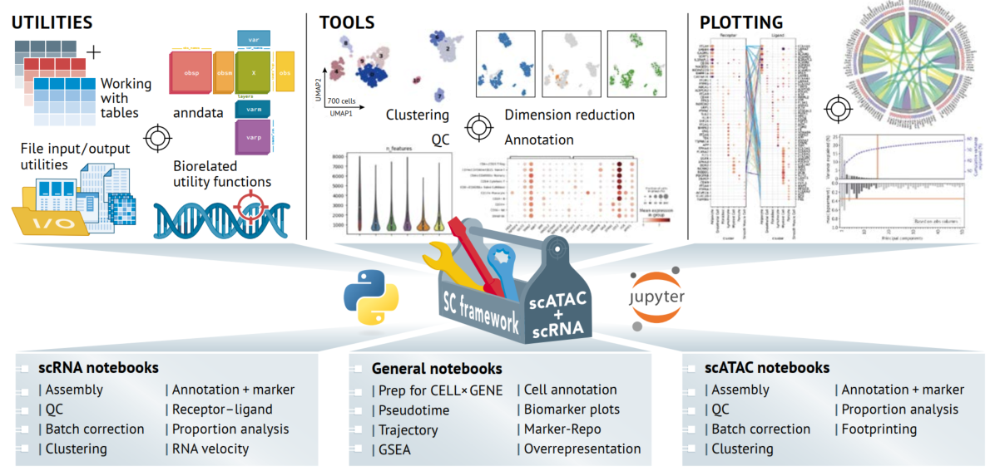

[](https://gitlab.gwdg.de/loosolab/software/sc_framework/-/commits/dev)


# SC Framework

A python framework for single cell analysis. It provides a plethora of functions for conducting common analysis tasks and respective visualization. It also includes a number of jupyter notebooks to further streamline the analysis process, making it easy to follow and reproduce analysis results.



# Readthedocs
The SC framework is accompanied by an extensive documentation where detailed information regarding available notebooks, functions and a multitude of examples can be found. It can be accesed using the following link:

https://loosolab.pages.gwdg.de/software/sc_framework/

# Installation
## 1. Environment & Package installation
1. Download the repository. This will download the repository to your current folder.
```
git clone https://gitlab.gwdg.de/loosolab/software/sc_framework.git
```
2. Change the working directory to the newly created repository directory.
```
cd sc_framework
```
3. Install analysis environment. Note: using `mamba` is faster than `conda`, but this requires mamba to be installed.
```
mamba env create -f sctoolbox_env.yml
```
4. Activate the environment.
```
conda activate sctoolbox
```
5. Install the sctoolbox framework into the environment.
```
pip install .[all]
```

## 2. Jupyter setup
Follow these steps if you want to run any of the provided jupyter notebooks.

1. If "jupyter-notebook" command is not available at this point: install notebook package.
```
pip install notebook
```
2. Register the environment as a jupyter kernel.
```
python -m ipykernel install --user --name sctoolbox --display-name "sctoolbox"
```

## 3. Git setup (for developers)
If you want to push changes to notebooks, you need to add the custom .gitconfig to the local .git config-file in order to enable clearing of notebook outputs:
```
git config --replace-all include.path "../.gitconfig"
```

# Analysis
## Idioms
### 1. Notebook structure
All notebooks follow the same general template and rules:
- Cells with a blue background require user input. 
- Most cells are locked and normally should not be changed.
- Notebooks usually start with loading the adata object and a cell for user inputs.
- The last step of a notebook is to store the analyzed adata as a `.h5ad` file to be used by following analysis steps.

### 2. Module settings
The SC framework provides a settings class (`SctoolboxConfig`) that is intended to set options not related to analysis like output paths, number of threads, file prefixes, logging level. The settings can be changed using the above mentioned class or via loading a config file (`sctoolbox.utils.settings_from_config`).

### 3. Logging
The framework provides two ways of logging. One being traditional logging usually written to a log file. This includes messages, warnings and errors that appear during execution of functions. The second is called function logging. Whenever a function that receives an adata object is executed a log will be added to the adata (`adata.uns["sctoolbox"]["log"]`) that stores information regarding the function call (name of the executed function, the parameters, the start time, who executed it, etc.). The function log can be accessed with `sctoolbox.utils.get_parameter_table(adata)`

## Getting Started
Once the evironment is set up and everything is installed it is time for starting an analysis using the provided jupyter notebooks. This can be done in a few easy steps:

1. Select the notebooks that fit to you datatype. At the moment we provide notebooks to analyze scRNA or scATAC data. The notebooks are located in directories in the root of this repository:
    - scRNA: `rna_analysis/`
    - scATAC: `atac_analysis/`

2. 1. Copy the folder of the step above to your preferred analysis path. E.g.: `cp -r rna_analysis/ /my/groubreaking/analysis/`

   2. (optional) We provide notebooks that are independent of the datatype. They are located in `general_notebooks/`. If you intend to run one (or more) of them we recommend to copy them to same directory as the other analysis notebooks. E.g. if you want to run pseudotime analysis `cp general_notebooks/pseudotime_analysis.ipynb /my/groubreaking/analysis/rna_analysis/notebooks/`

3. Access the notebooks within the directory and run them in order to do your analysis (general notebooks should be run last).

## Folder structure
While going through the analysis notebooks a folder structure is created to store all the results and intermediate steps (figures, .h5ad files, tables etc.). The default structure is created in the `*_analysis` directory that contains the notebooks. It is independent of datatype.

```
└── *_analysis
    ├── adatas
    │   └── *.h5ad
    ├── figures
    │   ├── 02_QC
    │   │   ├── *.png
    │   │   └── *.pdf
    │   ├── 03_batch_correction
    │   │   ├── *.png
    │   │   └── *.pdf
    │   ...
    ├── logs
    │   └── *.txt
    ├── notebooks
    │   ├── *.ipynb
    │   └── config.yml
    └── tables
        ├── 02_QC
        │   ├── *.xlsx
        │   └── *.tsv
        ├── 03_batch_correction
        │   ├── *.xlsx
        │   └── *.tsv
        ...
```

The `*_analysis` directory contains up to five subdirectories. In the beginning, there is only the `notebooks` directory it contains all of the analysis notebooks and a `config.yml`. The `config.yml` holds general settings (e.g. paths) for each notebook. It is loaded earlier in the execution of a notebook and can be adjusted as needed. The rest of the subdirectories are created during the execution of the notebooks as they are needed. `adatas/` contains intermediate `.h5ad` files created at the end of each notebook. `figures/` contains all of the plots created during analysis. `logs/` contains log-files and `tables/` stores additional result tables. The directories `figures/` and `tables/` are divided into one directory per notebook.

# FAQ
### Q: I have an old/ already started analysis. How do I find out what was done or who was responsible?

**A:** The function logging can be accessed using `sctoolbox.utils.get_parameter_table(adata)`. For more information see [here](https://loosolab.pages.gwdg.de/software/sc_framework/API/utils.html#sctoolbox.utils.decorator.get_parameter_table).

### Q: My `.h5ad` file is already pre-analyzed. I want to skip some of the analysis notebooks. What do I do?

**A:** You should always start with the assembly notebook (the first notebook). This ensures a proper output structure. Afterwards, go to the first notebook you want to run

### Q: I have encountered a bug, I have a feature request, there is something I need help with or want to discuss.

**A:** We are always happy to help but it can be hard to keep track of everything at once. So if you encounter anything that you feel needs attention open an issue with a detailed explanation and if possible small code examples. Issues can be opened [here](https://gitlab.gwdg.de/loosolab/software/sc_framework/-/issues). Thank you!
